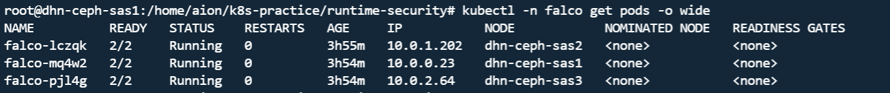
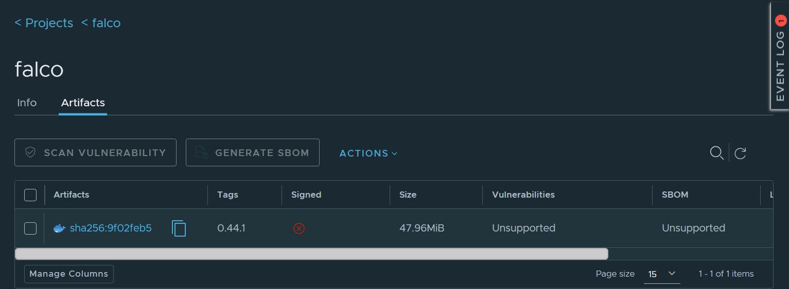
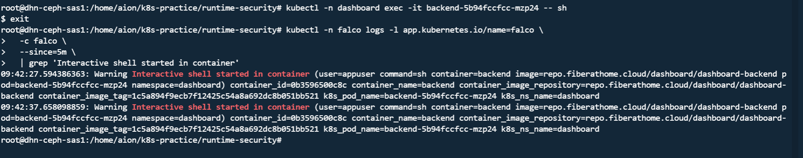
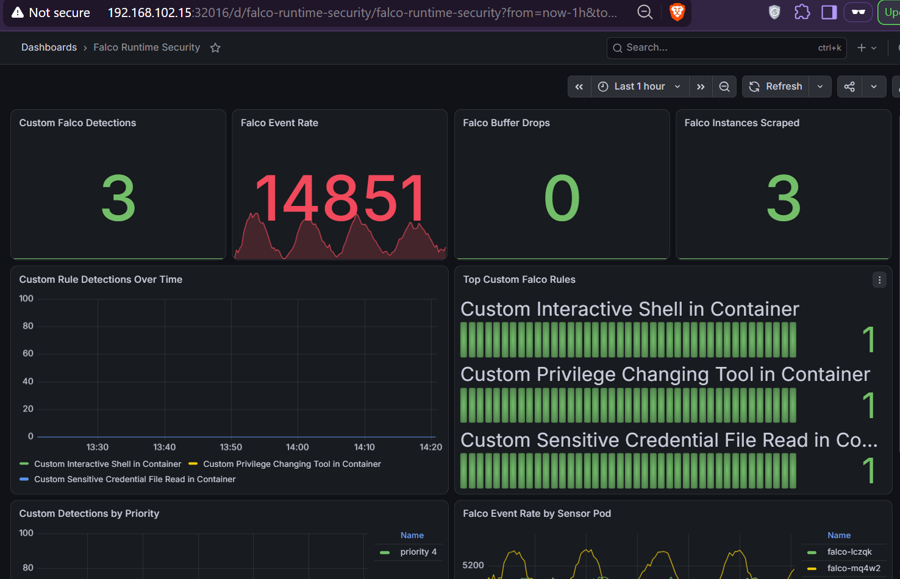

# Kubernetes Runtime Security with Falco, Prometheus, and Grafana

## Overview

This project implements runtime security monitoring for a three-node bare-metal Kubernetes cluster using **Falco 0.44.1** with the **modern eBPF** driver.

The objective was to build a complete runtime-security workflow rather than only install Falco:

- run Falco as a DaemonSet on every node
- pull Falco from a private Harbor registry
- use a dedicated pull-only Harbor robot account
- create and tune 10 custom runtime rules
- safely trigger representative detections
- expose Falco's native Prometheus metrics
- reuse the existing kube-prometheus-stack
- provision a Grafana dashboard as code
- document troubleshooting and false-positive tuning

## Environment

| Component | Value |
|---|---|
| OS | Ubuntu 24.04 |
| `sas1` | `dhn-ceph-sas1` / `192.168.102.15` |
| `sas2` | `dhn-ceph-sas2` / `192.168.102.17` |
| `sas3` | `dhn-ceph-sas3` / `192.168.102.19` |
| CNI | Cilium |
| Storage | Rook-Ceph |
| Falco | `0.44.1` |
| Falco Helm chart | `9.1.0` |
| Driver | `modern_ebpf` |
| Registry | `repo.fiberathome.cloud` |
| Monitoring | existing `kube-prometheus-stack` |

> Cilium and Falco both use eBPF, but for different purposes. Cilium uses it primarily for networking and policy; Falco uses it for runtime event visibility.

## Architecture

```text
Kubernetes workloads
        |
        v
Falco DaemonSet on sas1 / sas2 / sas3
        |
        | modern eBPF syscall/runtime capture
        v
Built-in + 10 custom Falco rules
        |
        +--------------------------+
        |                          |
        v                          v
Falco alert logs             Native Falco metrics
                                   |
                                   v
                           falco-metrics Service
                                   |
                                   v
                              ServiceMonitor
                                   |
                                   v
                         kube-prometheus-stack
                                   |
                                   v
                                Grafana
```

See [`docs/architecture.md`](docs/architecture.md) for more detail.

## Why modern eBPF

```yaml
driver:
  enabled: true
  kind: modern_ebpf
```

Falco confirmed:

```text
Opening 'syscall' source with modern BPF probe.
```

The native metrics endpoint also reported `engine_name="modern_bpf"`.

## Private Harbor registry

Falco is pulled from:

```text
repo.fiberathome.cloud/falco/falco:0.44.1
```

The public project does not contain registry credentials. The values file only references the Kubernetes image pull secret:

```yaml
image:
  registry: repo.fiberathome.cloud
  repository: falco/falco
  tag: "0.44.1"

imagePullSecrets:
  - name: harbor-secret
```

A dedicated pull-only Harbor robot account is used for the Falco project.

## Falco OCI image troubleshooting

The original OCI archive advertised ARM64 and AMD64, but only the AMD64 content was available locally. Importing all platforms failed because the ARM64 blob was missing.

The successful import was:

```bash
ctr images import \
  --platform linux/amd64 \
  /tmp/falco-0.44.1-amd64.tar
```

This demonstrated that a multi-architecture OCI index can reference blobs that are not actually present in a local export.

## Helm deployment

Falco is deployed from a local chart directory:

```bash
helm upgrade --install falco ./falco \
  -n falco \
  -f falco-values.yaml
```

What each part means:

- `helm upgrade --install`: install if missing, otherwise upgrade
- `falco`: Helm release name
- `./falco`: local chart directory
- `-n falco`: target namespace
- `-f falco-values.yaml`: project-specific overrides

## Why we run `helm template`

Before deployment, changes are rendered locally:

```bash
helm template falco ./falco \
  -n falco \
  -f falco-values.yaml \
  > /tmp/falco-rendered.yaml
```

This does **not** change the cluster. It renders ordinary Kubernetes YAML and writes it to `/tmp/falco-rendered.yaml` for inspection.

It was used to check:

- whether all custom rules were rendered
- indentation problems
- generated ServiceMonitor labels
- duplicate YAML keys
- expected Service ports

Example:

```bash
grep -E '^    - rule: Custom ' /tmp/falco-rendered.yaml
```

## Custom rules

The project contains 10 custom rules:

1. Interactive shell in container
2. Sensitive credential file read
3. Privilege-changing tool execution
4. Namespace manipulation tools
5. Container runtime socket access
6. Suspicious network tools
7. Download piped to shell
8. SSH private key access
9. `kubectl` execution inside a container
10. Suspicious system modification or temporary execution

See [`docs/custom-rules.md`](docs/custom-rules.md).

## Rule matching behavior

The final configuration uses:

```yaml
falco:
  rule_matching: all
```

With the original `first` behavior, a built-in shell rule matched before the custom interactive-shell rule. `all` allows overlapping built-in and custom rules to emit alerts for the same event.

Trade-off: better visibility, but potentially more alert volume and processing overhead.

## Native Prometheus metrics

`falco-exporter` was investigated but not used because it is deprecated and Falco 0.38+ provides native Prometheus metrics.

```yaml
metrics:
  enabled: true
  interval: 15s
  rulesCountersEnabled: true
  service:
    create: true
```

Falco exposes `/metrics` on TCP `8765`.

The existing Prometheus stack discovers Falco through:

```yaml
serviceMonitor:
  create: true
  labels:
    release: kube-prometheus-stack
  interval: 15s
  scrapeTimeout: 10s
  endpointPort: "metrics"
```

The `release: kube-prometheus-stack` label is required by the Prometheus ServiceMonitor selector.

## Prometheus verification

Start a port-forward:

```bash
kubectl -n monitoring port-forward \
  svc/kube-prometheus-stack-prometheus \
  9090:9090
```

Check readiness:

```bash
curl -sS http://127.0.0.1:9090/-/ready
```

Expected:

```text
Prometheus Server is Ready.
```

Useful Falco metrics include:

```text
falcosecurity_falco_version_info
falcosecurity_falco_rules_matches_total
falcosecurity_scap_n_evts_total
falcosecurity_scap_n_drops_buffer_total
```

## Grafana dashboard as code

The dashboard is stored in:

```text
grafana/falco-runtime-security-dashboard.yaml
```

The existing Grafana sidecar watches ConfigMaps labeled:

```yaml
grafana_dashboard: "1"
```

Validate without changing the cluster:

```bash
kubectl apply --dry-run=client \
  -f grafana/falco-runtime-security-dashboard.yaml
```

Apply:

```bash
kubectl apply \
  -f grafana/falco-runtime-security-dashboard.yaml
```

## Dashboard panels

- Custom Falco Detections
- Falco Event Rate
- Falco Buffer Drops
- Falco Instances Scraped
- Cumulative Custom Rule Detections
- Top Custom Falco Rules
- Cumulative Detections by Priority
- Falco Event Rate by Sensor Pod

## PromQL lesson: cumulative counters vs `increase()`

The first summary panels used `increase()` and displayed misleading zeros. A new metric series may first appear in Prometheus already at value `1`, so Prometheus may never observe the previous `0`.

For cumulative summaries, the dashboard now uses:

```promql
sum(
  falcosecurity_falco_rules_matches_total{
    tag_custom="true"
  }
)
```

Top rules:

```promql
topk(
  10,
  sum by (rule_name) (
    falcosecurity_falco_rules_matches_total{
      tag_custom="true"
    }
  )
)
```

`rate()` and `increase()` remain appropriate for event-rate and drop-over-window panels.

## Controlled tests

Three representative rules were deliberately triggered against an owned backend workload.

### Interactive shell

```bash
kubectl -n dashboard exec -it \
  backend-5b94fccfcc-mzp24 -- sh
```

Then `exit`.

### Service-account token read

```bash
kubectl -n dashboard exec \
  backend-5b94fccfcc-mzp24 -- \
  sh -c 'cat /var/run/secrets/kubernetes.io/serviceaccount/token >/dev/null'
```

### Privilege-changing tool

```bash
kubectl -n dashboard exec \
  backend-5b94fccfcc-mzp24 -- \
  su --version
```

After the final Falco restart, Prometheus showed one match for each of these custom rules, for a total of `3`.

## False-positive tuning

Two important tuning cycles were completed.

### Service-account token noise

The first version alerted on every service-account token read. Legitimate reads from ArgoCD, Cilium, and CoreDNS created noise.

The rule was narrowed so token reads are suspicious only when performed by shell-like or command-line tooling such as `cat`, `grep`, `curl`, `wget`, Python, Perl, Ruby, or shell binaries.

### Prometheus config reloader noise

The broad system-modification rule originally treated every `/etc/` write as suspicious. It repeatedly alerted on `/bin/prometheus-config-reloader` writing generated files below:

```text
/etc/prometheus/config_out/
/etc/alertmanager/config_out/
```

A narrow exception was added for that process, namespace, and path combination instead of excluding the entire `monitoring` namespace.

## Troubleshooting example: CrashLoopBackOff

During one rule edit, the configuration accidentally contained:

```yaml
condition: >
condition: >
```

Kubernetes YAML still rendered, but Falco rejected the rule and one pod entered `CrashLoopBackOff`.

The root cause was found with:

```bash
kubectl -n falco logs <falco-pod> \
  -c falco \
  --previous
```

`--previous` retrieves logs from the previous crashed container instance.

Falco reported `Value must be non-empty`. Inspecting the rendered rule showed the duplicate `condition:` line immediately.

See [`docs/testing-and-troubleshooting.md`](docs/testing-and-troubleshooting.md) for more detail.

## Repository structure

```text
runtime-security/
├── README.md
├── .gitignore
├── falco-values.yaml
├── grafana/
│   └── falco-runtime-security-dashboard.yaml
├── docs/
│   ├── architecture.md
│   ├── custom-rules.md
│   └── testing-and-troubleshooting.md
└── screenshots/
```

Local copies of upstream Helm charts are intentionally excluded from Git.

## Security notes

Do not commit:

- Harbor passwords
- Harbor robot tokens
- Kubernetes `dockerconfigjson` secrets
- Grafana credentials
- private keys
- service-account tokens

This project only references `harbor-secret` by name.

## Final validation state

- 3 healthy Falco DaemonSet pods
- modern eBPF driver
- 10 custom runtime-security rules loaded
- private Harbor image pull
- dedicated pull-only Harbor robot account
- native Falco Prometheus metrics
- ServiceMonitor integration
- existing kube-prometheus-stack reused
- Grafana dashboard managed as code
- 3 representative detections verified end-to-end
- false-positive tuning completed
- 0 observed Falco buffer drops during validation

## Project Screenshots

### Falco pods healthy across all three nodes



### Falco image stored in Harbor



### Real custom Falco alert

This screenshot shows a controlled interactive-shell test and the resulting Falco alert.



### Grafana runtime-security dashboard



## Future improvements

- forward Falco alerts to Loki
- add Falcosidekick
- add Slack/email alerting
- add Kubernetes audit-event monitoring
- map rules to MITRE ATT&CK
- add CI-based rule validation
- add Prometheus alerts for high-severity detections
- build workload-level event dashboards using a log backend

## Conclusion

The useful part of runtime security is not simply installing Falco. It is the full cycle:

```text
deploy -> observe -> test -> debug -> measure -> tune -> validate -> document
```

The final result provides runtime visibility across the cluster while keeping secrets and upstream dependencies outside the public repository.
